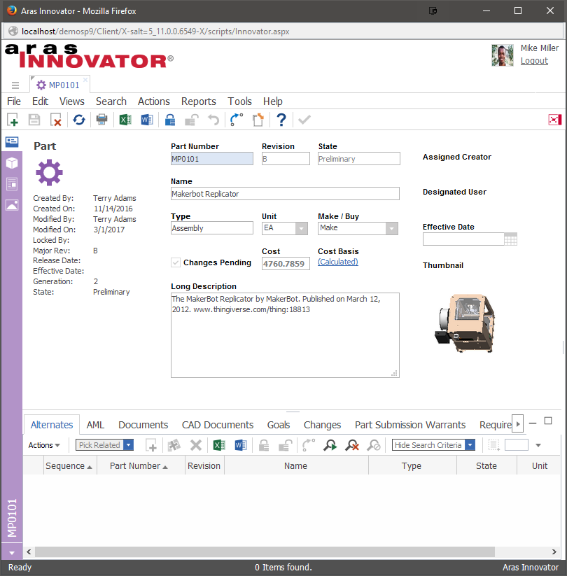

# Hiding Relationship Tabs in an Item Window by Identity

It may be necessary that only certain users or groups are able to view the multiple relationships to a single item.

This project demonstrates a code-free approach to handle this use case by using the Configurable User Interface (CUI) data model. Previous versions of this project would hide the relationship tabs for only a single Form. The configuration changes made in this project now hide the relationship tabs from any Form of a given ItemType.

## History

Release | Notes
--------|--------
[v5.0.0](https://github.com/ArasLabs/hide-tabs-by-identity/releases/tag/v5.0.0) | Updated to use CUI
[v4.0.0](https://github.com/ArasLabs/hide-tabs-by-identity/releases/tag/v4.0.0) | Tested on 12.0, 12.0 SP1
[v3.0.1](https://github.com/ArasLabs/hide-tabs-by-identity/releases/tag/v3.0.1) | Fix readme and screenshot for Aras11SP12.
[v3](https://github.com/ArasLabs/hide-tabs-by-identity/releases/tag/v3) | Updated project with import package to support Aras 11 SP9
[v2](https://github.com/ArasLabs/hide-tabs-by-identity/releases/tag/v2) | Updated document to handle deprecated methods
[v1](https://github.com/ArasLabs/hide-tabs-by-identity/releases/tag/v1) | Word Document with Method Code and Instructions

#### Supported Aras Versions

Project | Aras
--------|------
[v5.0.0](https://github.com/ArasLabs/hide-tabs-by-identity/releases/tag/v5.0.0) | 12.0 SP7
[v4.0.0](https://github.com/ArasLabs/hide-tabs-by-identity/releases/tag/v4.0.0) | 12.0, 12.0 SP1
[v3.0.1](https://github.com/ArasLabs/hide-tabs-by-identity) | 11 SP12
[v3](https://github.com/ArasLabs/hide-tabs-by-identity/releases/tag/v3) | 11 SP9
[v2](https://github.com/ArasLabs/hide-tabs-by-identity/releases/tag/v2) | 8.2.0, 9.0.1,9.1.0
[v1](https://github.com/ArasLabs/hide-tabs-by-identity/releases/tag/v1) | 8.2.0, 9.0.1,9.1.0

## Installation

#### Important!
**Always back up your code tree and database before applying an import package or code tree patch!**

### Pre-requisites

1. Aras Innovator installed (version 12.0 SPx preferred)
2. Aras Package Import tool
3. labs_HideTabsByIdentity import package

### Install Steps

1. Backup your database and store the BAK file in a safe place.
2. Open up the Aras Package Import tool.
3. Enter your login credentials and click **Login**
    * _Note: You must login as root for the package import to succeed!_
4. Enter the package name in the TargetRelease field.
    * Optional: Enter a description in the Description field.
5. Enter the path to your local `..\HideTabsByIdentity\Import\imports.mf` file in the Manifest File field.
6. Select **aras.labs.cui.HideTabsByIdentity** in the Available for Import field.
7. Select Type = **Merge** and Mode = **Thorough Mode**.
8. Click **Import** in the top left corner.
9. Close the Aras Package Import tool.

## Usage

The configuration in this project hides the BOM and BOM Structure tabs for any user who is not a member of the Administrators identity. 

1. Log in to Aras as a user in the Administrators identity - i.e. 'admin'.
2. Select **Design > Parts** in the Table of Contents (TOC).
3. Open up any Part item for viewing.

The BOM and BOM Structure tabs will be visible because the current user is a member of the Administrators identity.

4. Log out of Aras.
5. Log in to Aras as a user who does not belong to the Administrators identity.
6. Select **Design > Parts** in the Table of Contents (TOC).
7. Open up any Part item for viewing.

The BOM and BOM Structure tabs will be hidden from the form. The first relationship tab that appears will be the 'Alternates' tab.

## Contributing

1. Fork it!
2. Create your feature branch: `git checkout -b my-new-feature`
3. Commit your changes: `git commit -am 'Add some feature'`
4. Push to the branch: `git push origin my-new-feature`
5. Submit a pull request

For more information on contributing to this project, another Aras Labs project, or any Aras Community project, shoot us an email at araslabs@aras.com.

## Credits

Documented and published by Eli Donahue for Aras Labs. @EliJDonahue

Maintained by Christopher Gillis for Aras Labs. @cgillis-aras

## License

Aras Labs projects are published to Github under the MIT license. See the [LICENSE file](./LICENSE.md) for license rights and limitations.